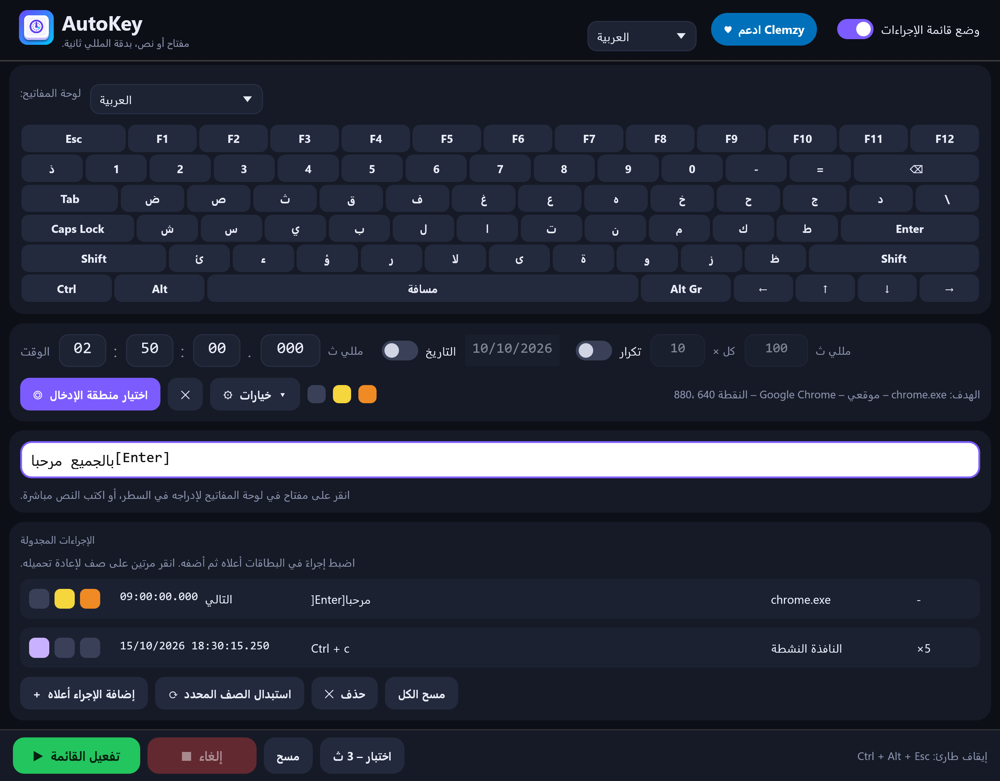

# AutoKey

**اكتب مفتاحًا أو نصًا أو اختصارًا في الوقت الدقيق الذي تحدده، وفي النافذة التي تختارها.**

🌐 [English](README.md) · [Français](README.fr.md) · [Español](README.es.md) · [Русский](README.ru.md) · **العربية** · [中文](README.zh.md)



AutoKey أداة صغيرة مكتوبة بلغة Rust تعمل على **Windows وLinux وmacOS**: ملف تنفيذي واحد حجمه من 4 إلى 6 ميغابايت، بلا تثبيت، يبدأ فورًا، وتبقى واجهته سلسة عند تغيير حجم النافذة.

## التنزيل

➡️ **[نزّل آخر إصدار](../../releases/latest)** — بلا تثبيت، ملف واحد لكل نظام:

| النظام | الملف | الحالة |
|---|---|---|
| Windows 10/11 بنظام 64 بت | `AutoKey.exe` | تمت تجربته |
| Linux، جلسة X11 أو Wayland (x86-64 وARM64) | `AutoKey-linux-x86_64.tar.gz` و`AutoKey-linux-aarch64.tar.gz` | جُرّب على Ubuntu 22.04 (x86-64)، مع X11 وWayland |
| macOS 11 فما فوق (Intel وApple Silicon) | `AutoKey-macos.zip` | يُبنى بنجاح، **لم يُجرَّب بعد على جهاز Mac حقيقي** |
| Windows على ARM | `AutoKey-windows-arm64.exe` | يُبنى بنجاح، لم يُجرَّب |

لا يوجد أي ملف موقّع رقميًا — راجع [ملاحظات حسب النظام](#ملاحظات-حسب-النظام) لمعرفة كيفية التشغيل الأول.

## المزايا

- **لوحة مفاتيح على الشاشة بـ 13 تخطيطًا** — AZERTY (FR وBE)، وQWERTY (US وUK وES وIT وBR)، وQWERTZ (DE وCH)، والروسي ЙЦУКЕН، والعربي، وDvorak وColemak. يُكتشف تخطيط لغة الإدخال في نظامك تلقائيًا؛ وتستخدم الصينية واليابانية تخطيط QWERTY (US).
- **واجهة بـ 6 لغات** — English وFrançais وEspañol وРусский والعربية و中文. تتبع اللغة لغة النظام ويمكن تغييرها من الشريط العلوي.
- **النص والمفاتيح في سطر واحد**: `hello[Enter]` يكتب «hello» ثم يضغط Enter. يُكتب النص بصيغة Unicode (علامات التشكيل والرموز وأي كتابة). المفتاح بين قوسين معقوفين (`[a]` و`[F5]` و`[Enter]`) ضغطة مفتاح حقيقية تُترجم وفق التخطيط الفعّال فعلًا في النافذة الهدف، فتعمل مع المعدّلات المضغوطة (Ctrl وAlt وShift وAltGr).
- **الوقت بدقة المللي ثانية**، مع تاريخ اختياري و**تكرار** اختياري (العدد والفاصل).
- **منطقة الهدف**: انقر مرة واحدة في الحقل المطلوب؛ يعثر AutoKey على تلك النافذة من جديد (حتى بعد إعادة تشغيل التطبيق الهدف)، ويستعيدها إن كانت مصغّرة، ويجلبها إلى المقدمة، وينقر في المنطقة، ثم يكتب. ويمتنع عن الكتابة إن لم يجد النافذة أو كانت مغطّاة بدل الكتابة عشوائيًا.
- **ثلاثة خيارات لكل إجراء**، تظهر كمربعات ملونة: 🟣 تصغير AutoKey عند البدء · 🟡 الانتقال إلى منطقة الهدف قبل الكتابة · 🟠 ثم العودة إلى حيث كنت.
- **وضع قائمة الإجراءات**: جدول عدة إجراءات، لكل منها وقته ونصه وهدفه وخياراته. تُنفَّذ بترتيب الوقت.
- **الإيقاف الطارئ**: `Ctrl + Alt + Esc` (وفي macOS `Ctrl + Option + Esc`، وفي Wayland زر الإلغاء)، يُلبّى في أي لحظة، حتى مع تصغير النافذة وأثناء الاستراحة الطويلة بين التكرارات. و**منع السكون** ما دام هناك إجراء مُفعَّل.
- **الدقة**: مع وجود هدف، تُجهَّز النافذة قبل الموعد بـ 1.5 ثانية ليُرسَل أول مفتاح في الوقت الدقيق (المقيس: من +1 إلى +2 مللي ثانية).
- **الأمان**: يُتخطّى أي إجراء تأخر أكثر من 30 ثانية (الحاسوب في السكون…) بدل كتابته في النافذة الخطأ؛ نسخة واحدة فقط؛ تُكتب الإعدادات بشكل ذري؛ ورسالة واضحة إذا رفض Windows المفاتيح (الهدف يعمل بصلاحيات المسؤول).
- الحقول الرقمية: انقر للكتابة أو اسحب أو استخدم `Ctrl + عجلة الفأرة`. تُحفظ الإعدادات في مجلد المستخدم (`%APPDATA%\AutoKey\reglages.json` في Windows، و`~/.config/AutoKey/` في Linux، و`~/Library/Application Support/AutoKey/` في macOS).

> العربية مترجمة بالكامل وتُعرض بشكل صحيح من اليمين إلى اليسار، لكن تخطيط النافذة نفسه غير معكوس. كُتبت الترجمات بعناية لكن لم يراجعها ناطقون أصليون: التصحيحات مرحّب بها جدًا (انظر *إضافة لغة أو تصحيحها*).

## بداية سريعة

1. انقر على مفاتيح لوحة المفاتيح التي على الشاشة (أو اكتب نصك) في السطر الأبيض.
2. اضبط الوقت.
3. *(اختياري)* **اختر منطقة الإدخال** ثم انقر في الحقل الذي تريد استهدافه.
4. **فعّل**. يتيح زر **اختبار (3 ث)** التجربة فورًا.

التطبيقات التي تعمل **بصلاحيات المسؤول** تتجاهل المفاتيح المرسلة من برنامج عادي: شغّل AutoKey بصلاحيات المسؤول في هذه الحالة.

## ملاحظات حسب النظام

**Windows** — الملف غير موقّع، لذا قد يحذّر SmartScreen عند التشغيل الأول: *مزيد من المعلومات* ← *تشغيل على أي حال*.

**Linux** — يعمل AutoKey على **X11** وعلى **Wayland**:
- **X11**: تمر المفاتيح والنقرات عبر XTest والنوافذ عبر EWMH، فيعمل كل شيء — منطقة الهدف وجلب النافذة إلى المقدمة و`Ctrl + Alt + Esc`.
- **Wayland**: لا يُسمح للبرامج بإرسال المفاتيح من تلقاء نفسها، لذا يطلب AutoKey ذلك من سطح المكتب عبر بوابة *سطح المكتب البعيد*. في المرة الأولى يعرض النظام نافذة تأكيد: اضغط **السماح** (في GNOME: **مشاركة**) — وتتذكر أسطح المكتب الحديثة اختيارك. تذهب المفاتيح بعد ذلك إلى **النافذة النشطة**: فـ Wayland يمنع أيضًا سرد النوافذ الأخرى أو التركيز عليها، لذا لا تتوفر منطقة الهدف ولا اختصار `Ctrl + Alt + Esc` (استخدم زر **إلغاء** وخيار *التصغير عند البدء* لإعادة التركيز إلى تطبيقك). والأحرف الغائبة عن تخطيط لوحة مفاتيحك تُكتب بإدخال Unicode عبر `Ctrl + Shift + U` الذي يفهمه GTK ومعظم تطبيقات سطح المكتب.

فك ضغط الأرشيف وشغّل `./autokey`. أدوات اختيارية: `xdg-open` (رابط التبرع)، و`systemd-inhibit` (منع السكون)، و`fc-match` (البحث عن الخطوط). جُرّب على Ubuntu 22.04 (GNOME 42): على X11 الكتابة وعلامات التشكيل والنص غير اللاتيني واختيار المنطقة وتركيز النافذة والدقة بالمللي ثانية (المقيس −3 مللي ثانية) والإيقاف الطارئ؛ وعلى Wayland الأحرف الكبيرة وعلامات التشكيل ورموز AltGr والنص السيريلي والصيني، مع حالتي منح الإذن ورفضه.

**macOS** — فك ضغط `AutoKey-macos.zip`. التطبيق غير موقّع وغير موثّق: عند التشغيل الأول انقر عليه بزر الفأرة الأيمن واختر *فتح*. سيطلب macOS السماح له في *إعدادات النظام ← الخصوصية والأمان ← تسهيلات الاستخدام* (لازم لإرسال المفاتيح) وفي *تسجيل الشاشة* لقراءة عناوين النوافذ الأخرى. الإيقاف الطارئ هو `Ctrl + Option + Esc` ويستخدم منع السكون الأداة `caffeinate`. يُبنى هذا الإصدار ويُفحص بالتكامل المستمر في GitHub لكنه **لم يعمل بعد على جهاز Mac حقيقي**: أخبرنا بما تجده.

## البناء من المصدر

المتطلبات: [Rust](https://rustup.rs)، إضافة إلى:

- **Windows**: سلسلة أدوات MSVC و*Build Tools for Visual Studio* («تطوير سطح المكتب بلغة C++»).
- **Linux**: `sudo apt install build-essential pkg-config libx11-dev libxkbcommon-dev libgl1-mesa-dev libwayland-dev` (أو ما يقابلها في توزيعتك).
- **macOS**: أدوات سطر الأوامر في Xcode (`xcode-select --install`).

```bash
cargo build --release
```

يُنتَج الملف التنفيذي في `target/release/autokey` (`autokey.exe` في Windows)، أو في المجلد المحدد في `.cargo/config.toml` إن وُجد.

الشيفرة الخاصة بكل نظام موجودة في `src/engine/` (`windows.rs` و`linux.rs` و`macos.rs`)؛ وكل ما عداها مشترك.

### إضافة لغة أو تصحيحها

جميع النصوص في جدول واحد هو `src/i18n.rs`: يحتوي كل إدخال على ترجماته الست جنبًا إلى جنب (يُتحقق منها عند الترجمة البرمجية). وتخطيطات لوحة المفاتيح في `src/keys.rs`. المساهمات مرحّب بها.

### ملاحظة تقنية: `vendor/eframe`

ينشئ `eframe` 0.36 نافذته مخفية قبل تهيئة OpenGL. على بعض برامج تشغيل Intel الحديثة (جُرّب: Iris Xe وبناء Windows 11 رقم 26300) تتجمد تهيئة OpenGL عندئذٍ إلى ما لا نهاية. `vendor/eframe` نسخة من `eframe 0.36.2` يختلف فيها **سطر واحد** (`with_visible(true)` في `src/native/glow_integration.rs`) وهي موصولة عبر `[patch.crates-io]` في `Cargo.toml`. يوزَّع `eframe` بترخيص MIT OR Apache-2.0 من فريق egui.

## الاختبارات الآلية

يقود `tests/ui_test.py` (Windows) النافذة الحقيقية (بفأرة ولوحة مفاتيح حقيقيتين) ويفحص 61 نقطة: لوحة المفاتيح والتخطيطات واللغات والحقول والخيارات ووضع القائمة والإلغاء والإغلاق والكتابة في نافذة هدف.

```bash
python tests/ui_test.py target/release/autokey.exe
```

يفحص `tests/linux_smoke.sh` (Linux، جلسة X11 مع `xdotool` و`wmctrl` و`xev` و`gedit`) الكتابة واختيار الهدف وتركيزه ودقة الوقت والإيقاف الطارئ.

```bash
bash tests/linux_smoke.sh target/release/autokey
```

يكتب `tests/wayland_smoke.sh` (جلسة Wayland مع `gedit`) نصًا متنوعًا عبر البوابة ويقارن النتيجة؛ وتضغط أنت *السماح* في نافذة النظام عند ظهورها.

```bash
bash tests/wayland_smoke.sh target/release/autokey
```

| متغير البيئة | التأثير |
|---|---|
| `AUTOKEY_SETTINGS=path.json` | استخدام ملف إعدادات آخر |
| `AUTOKEY_LANG=ar` / `AUTOKEY_LAYOUT=ar` | فرض اللغة / تخطيط لوحة المفاتيح |
| `AUTOKEY_AUTOARM=N` أو `HH:MM:SS` | تفعيل الإجراء بعد N ثانية (أو في الوقت المحدد) عند البدء |
| `AUTOKEY_AUTOPICK=1` | بدء اختيار المنطقة عند البدء |
| `AUTOKEY_SHOT=image.png` | حفظ لقطة للنافذة ثم الخروج |
| `AUTOKEY_BENCH=1` | قياس زمن الإطار أثناء تغيير الحجم (النتيجة في `%TEMP%\autokey_bench.txt`) |
| `AUTOKEY_STATE=state.json` | كتابة الحالة الداخلية وموضع كل مكوّن (يستخدمه `tests/ui_test.py`) |
| `AUTOKEY_SHOTS=folder` | لقطات شاشة عند الطلب (ملف `req.txt` يحوي الاسم) |

## ادعم المشروع

إذا كان AutoKey مفيدًا لك، يمكنك دعم تطويره: [**💙 تبرّع عبر PayPal**](https://www.paypal.com/donate/?hosted_button_id=NKCR6KK739WGS)

## المؤلف

**Clemzy** المعروف باسم **InforMagicien** — [رخصة MIT](LICENSE).
