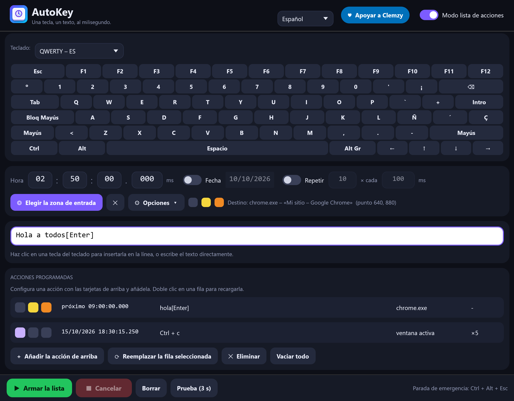

# AutoKey

**Escribe una tecla, un texto o un atajo a la hora exacta que elijas, en la ventana que elijas.**

🌐 [English](README.md) · [Français](README.fr.md) · **Español** · [Русский](README.ru.md) · [العربية](README.ar.md) · [中文](README.zh.md)



AutoKey es una pequeña utilidad escrita en Rust para **Windows, Linux y macOS**: un solo ejecutable de 4 a 6 MB, sin instalación, que arranca al instante y cuya interfaz sigue siendo fluida al redimensionar la ventana.

## Descargar

➡️ **[Descargar la última versión](../../releases/latest)** — sin instalación, un archivo por sistema:

| Sistema | Archivo | Estado |
|---|---|---|
| Windows 10/11, 64 bits | `AutoKey.exe` | probado |
| Linux, sesión X11 o Wayland (x86-64 y ARM64) | `AutoKey-linux-x86_64.tar.gz`, `AutoKey-linux-aarch64.tar.gz` | probado en Ubuntu 22.04 (x86-64), X11 y Wayland |
| macOS 11+ (Intel y Apple Silicon) | `AutoKey-macos.zip` | compila, **aún no probado en un Mac real** |
| Windows en ARM | `AutoKey-windows-arm64.exe` | compila, no probado |

Ningún archivo está firmado: consulta las [notas por sistema](#notas-por-sistema) para el primer arranque.

## Funciones

- **Teclado en pantalla con 13 distribuciones** — AZERTY (FR, BE), QWERTY (US, UK, ES, IT, BR), QWERTZ (DE, CH), ruso ЙЦУКЕН, árabe, Dvorak y Colemak. La distribución del idioma de entrada de tu sistema se detecta automáticamente; el chino y el japonés usan QWERTY (US).
- **Interfaz en 6 idiomas** — English, Français, Español, Русский, العربية, 中文. El idioma sigue al del sistema y se puede cambiar desde la cabecera.
- **Texto y teclas en una sola línea**: `hola[Enter]` escribe «hola» y luego pulsa Intro. El texto se escribe como Unicode (acentos, símbolos, cualquier escritura). Una tecla entre corchetes (`[a]`, `[F5]`, `[Enter]`) es una pulsación real, traducida con la distribución que está realmente activa en la ventana de destino, así que funciona con modificadores mantenidos (Ctrl, Alt, Mayús, AltGr).
- **Hora al milisegundo**, con fecha opcional y **repetición** opcional (número e intervalo).
- **Zona de destino**: haz clic una vez en el campo deseado; AutoKey vuelve a encontrar esa ventana (incluso tras reiniciar la aplicación de destino), la restaura si está minimizada, la trae al primer plano, hace clic en la zona y luego escribe. Se niega a escribir si la ventana no se encuentra o está tapada, en lugar de escribir al azar.
- **Tres opciones por acción**, mostradas como cuadrados de color: 🟣 minimizar AutoKey al empezar · 🟡 ir a la zona de destino antes de escribir · 🟠 volver después adonde estabas.
- **Modo lista de acciones**: programa varias acciones, cada una con su hora, texto, destino y opciones. Se ejecutan en orden de hora.
- **Parada de emergencia**: `Ctrl + Alt + Esc` (`Ctrl + Option + Esc` en macOS, el botón Cancelar en Wayland), atendida en cualquier momento, incluso con la ventana minimizada y durante una pausa larga entre repeticiones. **Anti-suspensión** mientras hay una acción armada.
- **Precisión**: con un destino, la ventana se prepara 1,5 s antes de la hora para que la primera tecla salga a la hora exacta (medido: +1 a +2 ms).
- **Seguridad**: una acción con más de 30 s de retraso (PC suspendido…) se omite en lugar de escribirse en la ventana equivocada; instancia única; ajustes escritos de forma atómica; mensaje claro si Windows rechaza las teclas (destino ejecutado como administrador).
- Campos numéricos: clic para escribir, arrastrar o `Ctrl + rueda del ratón`. Los ajustes se guardan en tu carpeta de usuario (`%APPDATA%\AutoKey\reglages.json` en Windows, `~/.config/AutoKey/` en Linux, `~/Library/Application Support/AutoKey/` en macOS).

> El árabe está totalmente traducido y se muestra correctamente de derecha a izquierda, pero la disposición de la ventana no se refleja en espejo. Las traducciones se escribieron con cuidado pero no las han revisado hablantes nativos: las correcciones son muy bienvenidas (véase *Añadir o corregir un idioma*).

## Inicio rápido

1. Haz clic en las teclas del teclado en pantalla (o escribe tu texto) en la línea blanca.
2. Ajusta la hora.
3. *(Opcional)* **Elegir la zona de entrada** y haz clic en el campo que quieres como destino.
4. **Armar**. El botón **Prueba (3 s)** permite probar de inmediato.

Las aplicaciones ejecutadas **como administrador** ignoran las teclas enviadas por un programa normal: en ese caso, ejecuta AutoKey como administrador.

## Notas por sistema

**Windows** — El archivo no está firmado: SmartScreen puede avisar en el primer arranque → *Más información* → *Ejecutar de todas formas*.

**Linux** — AutoKey funciona en **X11** y en **Wayland**:
- **X11**: las teclas y los clics pasan por XTest y las ventanas por EWMH, así que todo funciona — zona de destino, traer una ventana al primer plano, `Ctrl + Alt + Esc`.
- **Wayland**: un programa no puede enviar teclas por sí mismo, así que AutoKey se lo pide al escritorio mediante el portal *Escritorio remoto*. La primera vez, el sistema muestra una ventana de confirmación: pulsa **Permitir** (GNOME: **Compartir**); los escritorios recientes recuerdan tu elección. Las teclas van entonces a la **ventana activa**: Wayland también impide listar o enfocar otras ventanas, de modo que la zona de destino y el atajo `Ctrl + Alt + Esc` no están disponibles (usa el botón **Cancelar** y la opción *minimizar al empezar* para devolver el foco a tu aplicación). Los caracteres ausentes de tu distribución de teclado se escriben con la entrada Unicode `Ctrl + Mayús + U`, que entienden GTK y la mayoría de las aplicaciones del escritorio.

Descomprime el archivo y ejecuta `./autokey`. Herramientas opcionales: `xdg-open` (enlace de donación), `systemd-inhibit` (anti-suspensión), `fc-match` (búsqueda de fuentes). Probado en Ubuntu 22.04 (GNOME 42): en X11, escritura, acentos y texto no latino, elección de zona y foco de ventana, precisión al milisegundo (medido −3 ms) y parada de emergencia; en Wayland, mayúsculas, acentos, símbolos AltGr, texto cirílico y chino, permiso concedido y denegado.

**macOS** — Descomprime `AutoKey-macos.zip`. La aplicación no está firmada ni notarizada: en el primer arranque, haz clic derecho y elige *Abrir*. macOS te pide permitirla en *Ajustes del Sistema → Privacidad y seguridad → Accesibilidad* (necesario para enviar teclas) y, para leer los títulos de otras ventanas, *Grabación de pantalla*. La parada de emergencia es `Ctrl + Option + Esc` y la anti-suspensión usa `caffeinate`. Esta versión la compila y comprueba la integración continua de GitHub, pero **aún no se ha ejecutado en un Mac real**: cuéntanos lo que encuentres.

## Compilar

Requisitos: [Rust](https://rustup.rs), más:

- **Windows**: la cadena de herramientas MSVC y las *Build Tools for Visual Studio* («Desarrollo de escritorio con C++»).
- **Linux**: `sudo apt install build-essential pkg-config libx11-dev libxkbcommon-dev libgl1-mesa-dev libwayland-dev` (o los equivalentes de tu distribución).
- **macOS**: las herramientas de línea de comandos de Xcode (`xcode-select --install`).

```bash
cargo build --release
```

El ejecutable se genera en `target/release/autokey` (`autokey.exe` en Windows), o en la carpeta indicada por `.cargo/config.toml` si existe.

El código propio de cada sistema está en `src/engine/` (`windows.rs`, `linux.rs`, `macos.rs`); todo lo demás es común.

### Añadir o corregir un idioma

Todos los textos están en una sola tabla, `src/i18n.rs`: cada entrada contiene sus seis traducciones una junto a otra (se comprueba al compilar). Las distribuciones de teclado están en `src/keys.rs`. Las contribuciones son bienvenidas.

### Nota técnica: `vendor/eframe`

`eframe` 0.36 crea su ventana oculta antes de inicializar OpenGL. En algunos controladores Intel recientes (probado: Iris Xe, Windows 11 compilación 26300), la inicialización de OpenGL se bloquea entonces indefinidamente. `vendor/eframe` es una copia de `eframe 0.36.2` en la que cambia **una sola línea** (`with_visible(true)` en `src/native/glow_integration.rs`), conectada mediante `[patch.crates-io]` en `Cargo.toml`. `eframe` se distribuye bajo licencia MIT OR Apache-2.0 por el equipo de egui.

## Pruebas automáticas

`tests/ui_test.py` (Windows) maneja la ventana real (ratón y teclado reales) y comprueba 61 puntos: teclado, distribuciones, idiomas, campos, opciones, modo lista, cancelación, cierre, escritura en una ventana de destino.

```bash
python tests/ui_test.py target/release/autokey.exe
```

`tests/linux_smoke.sh` (Linux, sesión X11 con `xdotool`, `wmctrl`, `xev` y `gedit`) comprueba la escritura, la elección y el foco de un destino, la precisión de la hora y la parada de emergencia.

```bash
bash tests/linux_smoke.sh target/release/autokey
```

`tests/wayland_smoke.sh` (sesión Wayland con `gedit`) escribe un texto variado a través del portal y compara el resultado; tú pulsas *Permitir* en la ventana del sistema cuando aparece.

```bash
bash tests/wayland_smoke.sh target/release/autokey
```

| Variable de entorno | Efecto |
|---|---|
| `AUTOKEY_SETTINGS=ruta.json` | usa otro archivo de ajustes |
| `AUTOKEY_LANG=es` / `AUTOKEY_LAYOUT=qwerty-es` | fuerza el idioma / la distribución del teclado |
| `AUTOKEY_AUTOARM=N` o `HH:MM:SS` | arma la acción en N segundos (o a la hora indicada) al arrancar |
| `AUTOKEY_AUTOPICK=1` | inicia la elección de zona al arrancar |
| `AUTOKEY_SHOT=imagen.png` | guarda una captura de la ventana y sale |
| `AUTOKEY_BENCH=1` | mide el tiempo por fotograma al redimensionar (resultado en `%TEMP%\autokey_bench.txt`) |
| `AUTOKEY_STATE=estado.json` | escribe el estado interno y la posición de cada componente (lo usa `tests/ui_test.py`) |
| `AUTOKEY_SHOTS=carpeta` | capturas de pantalla a demanda (un archivo `req.txt` con el nombre) |

## Apoyar el proyecto

Si AutoKey te resulta útil, puedes apoyar su desarrollo: [**💙 Donar por PayPal**](https://www.paypal.com/donate/?hosted_button_id=NKCR6KK739WGS)

## Autor

**Clemzy** alias **InforMagicien** — [licencia MIT](LICENSE).
