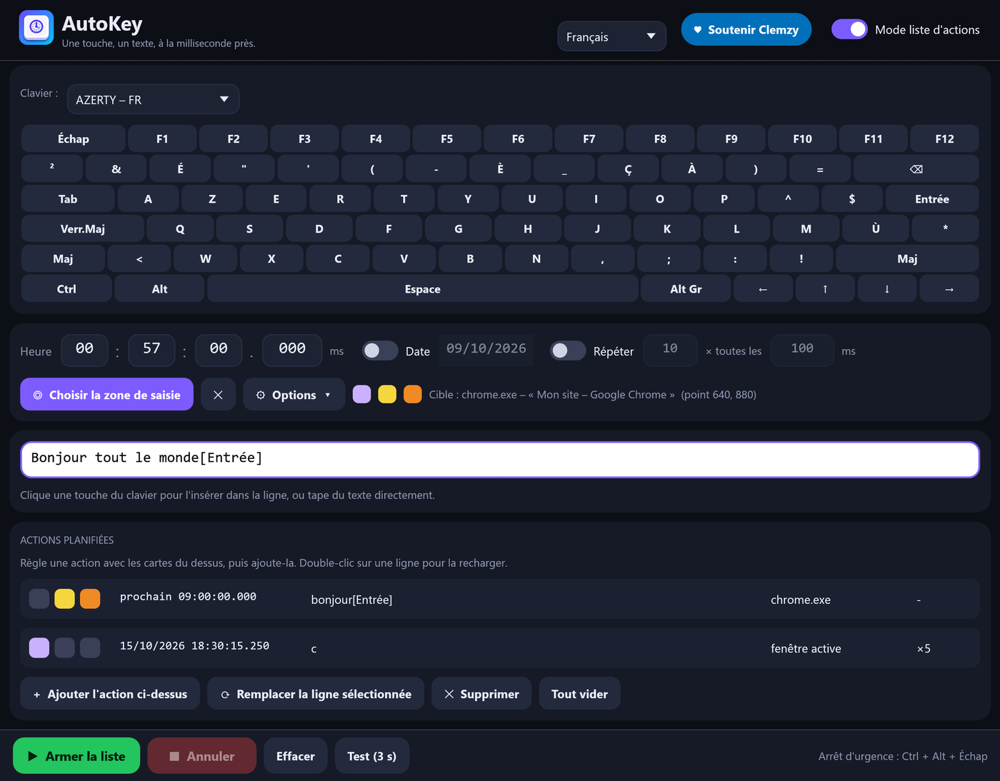

# AutoKey

**Tape une touche, un texte ou une combinaison à l'heure exacte que tu choisis — dans la fenêtre de ton choix.**

🌐 [English](README.md) · **Français**



AutoKey est un petit utilitaire écrit en Rust pour **Windows, Linux et macOS** : un seul exécutable de 4 à 6 Mo, sans installation, qui démarre instantanément et dont l'interface reste fluide quand on redimensionne la fenêtre.

## Télécharger

➡️ **[Télécharger la dernière version](../../releases/latest)** — sans installation, un fichier par système :

| Système | Fichier | État |
|---|---|---|
| Windows 10/11, 64 bits | `AutoKey.exe` | testé |
| Linux, session X11 (x86-64 et ARM64) | `AutoKey-linux-x86_64.tar.gz`, `AutoKey-linux-aarch64.tar.gz` | testé sur Ubuntu 22.04 (x86-64) |
| macOS 11+ (Intel et Apple Silicon) | `AutoKey-macos.zip` | compile, **pas encore testé sur un vrai Mac** |
| Windows sur ARM | `AutoKey-windows-arm64.exe` | compile, non testé |

Aucun fichier n'est signé — voir les [remarques par système](#remarques-par-système) pour le premier lancement.

## Fonctions

- **Clavier à l'écran en 13 dispositions** — AZERTY (FR, BE), QWERTY (US, UK, ES, IT, BR), QWERTZ (DE, CH), russe ЙЦУКЕН, arabe, Dvorak et Colemak. La disposition de ta langue de saisie Windows est détectée automatiquement ; le chinois et le japonais utilisent le QWERTY (US).
- **Interface en 6 langues** — English, Français, Español, Русский, العربية, 中文. La langue suit celle de Windows et se change depuis l'en-tête.
- **Texte et touches dans une seule ligne** : `bonjour[Entrée]` tape « bonjour » puis appuie sur Entrée. Le texte est tapé en Unicode (accents, symboles, toute écriture). Une touche entre crochets (`[a]`, `[F5]`, `[Entrée]`) est une vraie pression de touche, traduite selon la disposition réellement active dans la fenêtre cible : elle fonctionne avec des modificateurs maintenus (Ctrl, Alt, Maj, Alt Gr).
- **Heure à la milliseconde**, date optionnelle, **répétition** optionnelle (nombre et intervalle).
- **Zone cible** : clique une fois dans le champ voulu ; AutoKey retrouve la fenêtre (même après un redémarrage de l'application visée), la restaure si elle est réduite, la ramène au premier plan, clique dans la zone, puis écrit. Il refuse d'écrire si la fenêtre est introuvable ou masquée, plutôt que de taper au hasard.
- **Trois options par action**, repérées par des carrés colorés : 🟣 réduire AutoKey au lancement · 🟡 aller dans la zone avant d'écrire · 🟠 revenir ensuite où tu étais.
- **Mode liste d'actions** : plusieurs actions, chacune avec son heure, son texte, sa cible et ses options, exécutées dans l'ordre des heures.
- **Arrêt d'urgence** : `Ctrl + Alt + Échap` (`Ctrl + Option + Échap` sous macOS), pris en compte à tout moment, même fenêtre réduite et pendant une longue pause entre deux répétitions. **Anti-veille** pendant qu'une action est armée.
- **Précision** : avec une cible, la fenêtre est préparée 1,5 s avant l'heure pour que la première touche parte à l'heure exacte (mesuré : +1 à +2 ms).
- **Sécurité** : une action en retard de plus de 30 s (PC en veille…) est ignorée plutôt que tapée dans la mauvaise fenêtre ; une seule instance ; réglages écrits de façon atomique ; message clair si Windows refuse les touches (cible lancée en administrateur).
- Champs numériques : clic pour taper, glisser, ou `Ctrl + molette`. Réglages mémorisés dans ton dossier utilisateur (`%APPDATA%\AutoKey\reglages.json` sous Windows, `~/.config/AutoKey/` sous Linux, `~/Library/Application Support/AutoKey/` sous macOS).

> L'arabe est entièrement traduit, correctement lié et ordonné de droite à gauche, mais la mise en page de la fenêtre n'est pas inversée. Les traductions ont été écrites avec soin mais pas relues par des locuteurs natifs : les corrections sont les bienvenues (voir *Ajouter ou corriger une langue*).

## Démarrage rapide

1. Clique sur les touches du clavier à l'écran (ou tape ton texte) dans la ligne blanche.
2. Règle l'heure.
3. *(Optionnel)* **Choisir la zone de saisie**, puis clique dans le champ visé.
4. **Armer**. Le bouton **Test (3 s)** permet d'essayer tout de suite.

Les applications lancées **en administrateur** ignorent les touches envoyées par un programme normal : lance alors AutoKey en administrateur.

## Remarques par système

**Windows** — Le fichier n'est pas signé : SmartScreen peut avertir au premier lancement → *Informations complémentaires* → *Exécuter quand même*.

**Linux** — AutoKey pilote les autres fenêtres par le protocole X11 : il fonctionne dans toute **session X11** (et avec les fenêtres X11 d'une session Wayland). Une application **Wayland** pure est hors d'atteinte : le système interdit à un programme d'envoyer des touches à une autre fenêtre. AutoKey affiche alors un avertissement ; ouvre plutôt une session « … sur Xorg » (roue crantée de l'écran de connexion). Décompresse l'archive et lance `./autokey`. Outils facultatifs : `xdg-open` (lien de don), `systemd-inhibit` (anti-veille), `fc-match` (recherche de polices). Testé sur Ubuntu 22.04 (X11) : frappe, accents et textes non latins, repérage de zone et mise au premier plan, précision à la milliseconde (mesuré −0,5 ms) et arrêt d'urgence.

**macOS** — Décompresse `AutoKey-macos.zip`. L'application n'est ni signée ni notariée : au premier lancement, clic droit → *Ouvrir*. macOS demande de l'autoriser dans *Réglages Système → Confidentialité et sécurité → Accessibilité* (nécessaire pour envoyer des touches) et, pour lire les titres des autres fenêtres, *Enregistrement de l'écran*. L'arrêt d'urgence est `Ctrl + Option + Échap` et l'anti-veille utilise `caffeinate`. Ce portage est compilé et vérifié par l'intégration continue de GitHub mais **n'a pas encore tourné sur un vrai Mac** : n'hésite pas à signaler ce que tu constates.

## Compiler

Prérequis : [Rust](https://rustup.rs), plus :

- **Windows** : la toolchain MSVC et les *Build Tools for Visual Studio* (composant « Développement Desktop en C++ »).
- **Linux** : `sudo apt install build-essential pkg-config libx11-dev libxkbcommon-dev libgl1-mesa-dev libwayland-dev` (ou les équivalents de ta distribution).
- **macOS** : les outils en ligne de commande de Xcode (`xcode-select --install`).

```bash
cargo build --release
```

L'exécutable est produit dans `target/release/autokey` (`autokey.exe` sous Windows), ou dans le dossier indiqué par `.cargo/config.toml` s'il existe.

Le code propre à chaque système est dans `src/engine/` (`windows.rs`, `linux.rs`, `macos.rs`) ; tout le reste est commun.

### Ajouter ou corriger une langue

Tous les textes sont dans un seul tableau, `src/i18n.rs` : chaque entrée contient ses six traductions côte à côte (vérifié à la compilation). Les dispositions de clavier sont dans `src/keys.rs`. Les contributions sont bienvenues.

### Remarque technique : `vendor/eframe`

`eframe` 0.36 crée sa fenêtre cachée avant d'initialiser OpenGL. Sur certains pilotes Intel récents (testé : Iris Xe, Windows 11 build 26300), l'initialisation OpenGL se bloque alors indéfiniment. `vendor/eframe` est une copie de `eframe 0.36.2` où **une seule ligne** change (`with_visible(true)` dans `src/native/glow_integration.rs`), branchée via `[patch.crates-io]` dans `Cargo.toml`. `eframe` est distribué sous licence MIT OU Apache-2.0 par l'équipe egui.

## Tests automatiques

`tests/ui_test.py` (Windows) pilote la vraie fenêtre (souris et clavier réels) et vérifie 61 points : clavier, dispositions, langues, champs, options, mode liste, annulation, fermeture, envoi dans une fenêtre cible.

```bash
python tests/ui_test.py target/release/autokey.exe
```

`tests/linux_smoke.sh` (Linux, session X11 avec `xdotool`, `wmctrl`, `xev` et `gedit`) vérifie la frappe, le repérage et la mise au premier plan d'une cible, la précision de l'heure et l'arrêt d'urgence.

```bash
bash tests/linux_smoke.sh target/release/autokey
```

| Variable d'environnement | Effet |
|---|---|
| `AUTOKEY_SETTINGS=chemin.json` | utilise un autre fichier de réglages |
| `AUTOKEY_LANG=fr` / `AUTOKEY_LAYOUT=azerty-fr` | force la langue / la disposition du clavier |
| `AUTOKEY_AUTOARM=N` ou `HH:MM:SS` | arme l'action dans N secondes (ou à l'heure donnée) dès le démarrage |
| `AUTOKEY_AUTOPICK=1` | lance le repérage de zone dès le démarrage |
| `AUTOKEY_SHOT=image.png` | enregistre une capture de la fenêtre puis quitte |
| `AUTOKEY_BENCH=1` | mesure le temps d'image pendant des redimensionnements (résultat dans `%TEMP%\autokey_bench.txt`) |
| `AUTOKEY_STATE=etat.json` | écrit l'état interne et la position de chaque composant (utilisé par `tests/ui_test.py`) |
| `AUTOKEY_SHOTS=dossier` | capture d'écran à la demande (fichier `req.txt` contenant le nom) |

## Soutenir le projet

Si AutoKey te rend service, tu peux soutenir son développement : [**💙 Faire un don via PayPal**](https://www.paypal.com/donate/?hosted_button_id=NKCR6KK739WGS)

## Auteur

**Clemzy** aka **InforMagicien** — licence [MIT](LICENSE).
