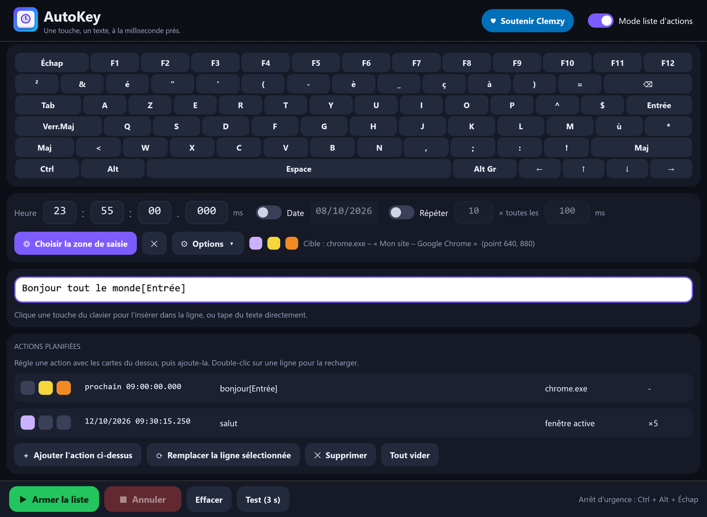

# AutoKey

**Type a key, a text or a shortcut at the exact time you choose — in the window you choose.**

🌐 **English** · [Français](README.fr.md) · [Español](README.es.md) · [Русский](README.ru.md) · [العربية](README.ar.md) · [中文](README.zh.md)



AutoKey is a small utility written in Rust for **Windows, Linux and macOS**: a single executable of 4 to 6 MB, no installation, instant startup, and an interface that stays smooth when you resize the window.

## Download

➡️ **[Download the latest release](../../releases/latest)** — no installation, one file per system:

| System | File | Status |
|---|---|---|
| Windows 10/11, 64-bit | `AutoKey.exe` | tested |
| Linux, X11 or Wayland session (x86-64 and ARM64) | `AutoKey-linux-x86_64.tar.gz`, `AutoKey-linux-aarch64.tar.gz` | tested on Ubuntu 22.04 (x86-64), X11 and Wayland |
| macOS 11+ (Intel and Apple Silicon) | `AutoKey-macos.zip` | compiles, **not yet tested on a real Mac** |
| Windows on ARM | `AutoKey-windows-arm64.exe` | compiles, not tested |

None of the files is code-signed — see [Platform notes](#platform-notes) for the first launch.

## Features

- **On-screen keyboard in 13 layouts** — AZERTY (FR, BE), QWERTY (US, UK, ES, IT, BR), QWERTZ (DE, CH), Russian ЙЦУКЕН, Arabic, Dvorak and Colemak. The layout of your Windows input language is detected automatically; Chinese and Japanese users get QWERTY (US).
- **Interface in 6 languages** — English, Français, Español, Русский, العربية, 中文. The language follows Windows and can be changed from the header.
- **Text and keys in one line**: `hello[Enter]` types "hello" then presses Enter. Text is typed as Unicode (accents, symbols, any script). A key in brackets (`[a]`, `[F5]`, `[Enter]`) is a real key press, translated through the layout actually active in the target window, so it works with held modifiers (Ctrl, Alt, Shift, AltGr).
- **Time down to the millisecond**, with an optional date and an optional **repeat** (count and interval).
- **Target area**: click once in the input field you want; AutoKey finds that window again (even after a restart of the target application), restores it if minimized, brings it to the front, clicks the area, then types. It refuses to type if the window cannot be found or is covered, rather than typing at random.
- **Three options per action**, shown as colored squares: 🟣 minimize AutoKey on start · 🟡 go to the target area before typing · 🟠 then return to where you were.
- **Action list mode**: schedule several actions, each with its own time, text, target and options. They run in time order.
- **Emergency stop**: `Ctrl + Alt + Esc` (`Ctrl + Option + Esc` on macOS, the Cancel button on Wayland), honored at any moment, even when the window is minimized and during a long pause between repeats. **Sleep prevention** while an action is armed.
- **Precision**: with a target, the window is prepared 1.5 s before the time so the first key is sent at the exact time (measured: +1 to +2 ms).
- **Safety**: an action more than 30 s late (PC asleep…) is skipped instead of being typed into the wrong window; single instance; settings written atomically; a clear message if Windows refuses the keys (target running as administrator).
- Numeric fields: click to type, drag, or `Ctrl + mouse wheel`. Settings are remembered in your user folder (`%APPDATA%\AutoKey\reglages.json` on Windows, `~/.config/AutoKey/` on Linux, `~/Library/Application Support/AutoKey/` on macOS).

> Arabic is fully translated and correctly shaped and ordered right-to-left, but the window layout itself is not mirrored. The translations were written with care but not reviewed by native speakers: corrections are very welcome (see *Adding or fixing a language* below).

## Quick start

1. Click keys on the on-screen keyboard (or type your text) in the white line.
2. Set the time.
3. *(Optional)* **Pick the input area**, then click in the field you want to target.
4. **Arm**. The **Test (3 s)** button lets you try right away.

Applications running **as administrator** ignore keys sent by a normal program: run AutoKey as administrator in that case.

## Platform notes

**Windows** — The file is not code-signed, so SmartScreen may warn you on first launch: *More info* → *Run anyway*.

**Linux** — AutoKey works on **X11** and on **Wayland**:
- **X11**: keys and clicks go through XTest and windows through EWMH, so everything works — target area, bringing a window forward, `Ctrl + Alt + Esc`.
- **Wayland**: programs are not allowed to send keys on their own, so AutoKey asks the desktop through the *Remote Desktop* portal. The first time, the system shows a confirmation window: click **Allow** (GNOME: **Share**) — recent desktops remember your choice. Keys then go to the **active window**: Wayland also forbids listing or focusing other windows, so the target area and the `Ctrl + Alt + Esc` shortcut are not available (use the **Cancel** button, and the *minimize on start* option to give the focus back to your application). Characters missing from your keyboard layout are typed with the `Ctrl + Shift + U` Unicode input, understood by GTK and most desktop applications.

Extract the archive and run `./autokey`. Optional helpers: `xdg-open` (donate link), `systemd-inhibit` (sleep prevention), `fc-match` (font lookup). Tested on Ubuntu 22.04 (GNOME 42): on X11, typing, accents and non-Latin text, target picking and window focus, millisecond timing (measured −3 ms) and emergency stop; on Wayland, capital letters, accents, AltGr symbols, Cyrillic and Chinese text, permission granted and refused.

**macOS** — Unzip `AutoKey-macos.zip`. The app is not signed or notarized: on first launch, right-click it and choose *Open*. macOS asks you to allow it in *System Settings → Privacy & Security → Accessibility* (needed to send keys) and, to read the titles of other windows, *Screen Recording*. The emergency stop is `Ctrl + Option + Esc` and sleep prevention uses `caffeinate`. This port is built and checked by the continuous integration on GitHub but **has not been run on a real Mac yet**: please report what you find.

## Build from source

Requirements: [Rust](https://rustup.rs), plus:

- **Windows**: the MSVC toolchain and the *Build Tools for Visual Studio* ("Desktop development with C++").
- **Linux**: `sudo apt install build-essential pkg-config libx11-dev libxkbcommon-dev libgl1-mesa-dev libwayland-dev` (or your distribution's equivalents).
- **macOS**: the Xcode command line tools (`xcode-select --install`).

```bash
cargo build --release
```

The executable is produced in `target/release/autokey` (`autokey.exe` on Windows), or in the folder set by `.cargo/config.toml` if present.

The system-specific code lives in `src/engine/` (`windows.rs`, `linux.rs`, `macos.rs`); everything else is shared.

### Adding or fixing a language

All texts are in one table, `src/i18n.rs`: each entry lists its six translations side by side (checked at compile time). Keyboard layouts are in `src/keys.rs`. Pull requests welcome.

### Technical note: `vendor/eframe`

`eframe` 0.36 creates its window hidden before initializing OpenGL. On some recent Intel drivers (tested: Iris Xe, Windows 11 build 26300) OpenGL initialization then hangs forever. `vendor/eframe` is a copy of `eframe 0.36.2` where **one line** differs (`with_visible(true)` in `src/native/glow_integration.rs`), wired in through `[patch.crates-io]` in `Cargo.toml`. `eframe` is distributed under MIT OR Apache-2.0 by the egui team.

## Automated tests

`tests/ui_test.py` (Windows) drives the real window (real mouse and keyboard) and checks 61 points: keyboard, layouts, languages, fields, options, list mode, cancellation, closing, typing into a target window.

```bash
python tests/ui_test.py target/release/autokey.exe
```

`tests/linux_smoke.sh` (Linux, X11 session with `xdotool`, `wmctrl`, `xev` and `gedit`) checks typing, target picking and focus, timing precision and the emergency stop.

```bash
bash tests/linux_smoke.sh target/release/autokey
```

`tests/wayland_smoke.sh` (Wayland session with `gedit`) types a mixed text through the portal and compares the result; you click *Allow* in the system window when it appears.

```bash
bash tests/wayland_smoke.sh target/release/autokey
```

| Environment variable | Effect |
|---|---|
| `AUTOKEY_SETTINGS=path.json` | use another settings file |
| `AUTOKEY_LANG=en` / `AUTOKEY_LAYOUT=qwerty-us` | force the language / keyboard layout |
| `AUTOKEY_AUTOARM=N` or `HH:MM:SS` | arm the action in N seconds (or at the given time) at startup |
| `AUTOKEY_AUTOPICK=1` | start the target picker at startup |
| `AUTOKEY_SHOT=image.png` | save a screenshot of the window, then quit |
| `AUTOKEY_BENCH=1` | measure frame time while resizing (result in `%TEMP%\autokey_bench.txt`) |
| `AUTOKEY_STATE=state.json` | write the internal state and every component's position (used by `tests/ui_test.py`) |
| `AUTOKEY_SHOTS=folder` | on-demand screenshots (a `req.txt` file containing the name) |

## Support the project

If AutoKey is useful to you, you can support its development: [**💙 Donate via PayPal**](https://www.paypal.com/donate/?hosted_button_id=NKCR6KK739WGS)

## Author

**Clemzy** aka **InforMagicien** — [MIT license](LICENSE).
