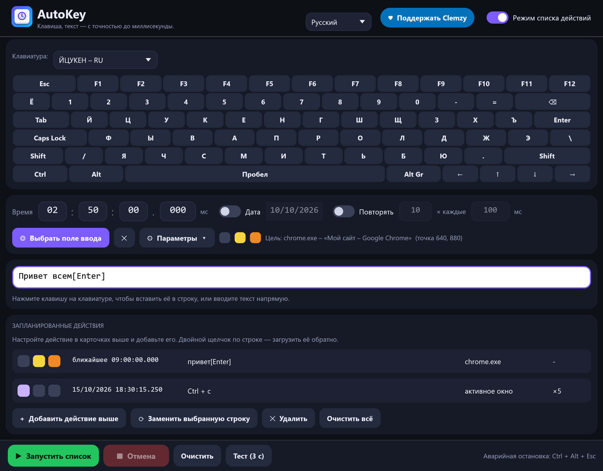

# AutoKey

**Вводит клавишу, текст или сочетание клавиш в точно заданное время — в выбранном вами окне.**

🌐 [English](README.md) · [Français](README.fr.md) · [Español](README.es.md) · **Русский** · [العربية](README.ar.md) · [中文](README.zh.md)



AutoKey — небольшая утилита на Rust для **Windows, Linux и macOS**: один исполняемый файл размером 4–6 МБ, без установки, мгновенный запуск, а интерфейс остаётся плавным при изменении размера окна.

## Скачать

➡️ **[Скачать последнюю версию](../../releases/latest)** — без установки, один файл на каждую систему:

| Система | Файл | Состояние |
|---|---|---|
| Windows 10/11, 64 бит | `AutoKey.exe` | проверено |
| Linux, сеанс X11 или Wayland (x86-64 и ARM64) | `AutoKey-linux-x86_64.tar.gz`, `AutoKey-linux-aarch64.tar.gz` | проверено в Ubuntu 22.04 (x86-64), X11 и Wayland |
| macOS 11+ (Intel и Apple Silicon) | `AutoKey-macos.zip` | собирается, **ещё не проверено на настоящем Mac** |
| Windows на ARM | `AutoKey-windows-arm64.exe` | собирается, не проверено |

Ни один из файлов не подписан — о первом запуске см. [примечания по системам](#примечания-по-системам).

## Возможности

- **Экранная клавиатура в 13 раскладках** — AZERTY (FR, BE), QWERTY (US, UK, ES, IT, BR), QWERTZ (DE, CH), русская ЙЦУКЕН, арабская, Dvorak и Colemak. Раскладка текущего языка ввода системы определяется автоматически; для китайского и японского используется QWERTY (US).
- **Интерфейс на 6 языках** — English, Français, Español, Русский, العربية, 中文. Язык берётся из системы и меняется в заголовке.
- **Текст и клавиши в одной строке**: `привет[Enter]` вводит «привет», затем нажимает Enter. Текст вводится как Unicode (диакритика, символы, любое письмо). Клавиша в квадратных скобках (`[a]`, `[F5]`, `[Enter]`) — это настоящее нажатие, преобразованное по раскладке, действительно активной в целевом окне, поэтому она работает с удерживаемыми модификаторами (Ctrl, Alt, Shift, AltGr).
- **Время с точностью до миллисекунды**, необязательная дата и необязательный **повтор** (число раз и интервал).
- **Целевая область**: щёлкните один раз в нужном поле; AutoKey снова находит это окно (даже после перезапуска целевого приложения), восстанавливает его, если оно свёрнуто, выводит на передний план, щёлкает в области и затем вводит текст. Если окно не найдено или перекрыто, он отказывается вводить, а не печатает наугад.
- **Три параметра для каждого действия**, обозначенных цветными квадратами: 🟣 свернуть AutoKey при запуске · 🟡 перейти в целевую область перед вводом · 🟠 затем вернуться туда, где вы были.
- **Режим списка действий**: планируйте несколько действий, каждое со своим временем, текстом, целью и параметрами. Они выполняются по порядку времени.
- **Аварийная остановка**: `Ctrl + Alt + Esc` (`Ctrl + Option + Esc` в macOS, кнопка «Отмена» в Wayland) работает в любой момент, даже при свёрнутом окне и во время долгой паузы между повторами. **Запрет засыпания**, пока действие взведено.
- **Точность**: при наличии цели окно готовится за 1,5 с до назначенного времени, чтобы первая клавиша ушла точно вовремя (измерено: +1…+2 мс).
- **Безопасность**: действие, опоздавшее более чем на 30 с (компьютер спал…), пропускается, а не вводится в чужое окно; один экземпляр; настройки записываются атомарно; понятное сообщение, если Windows отклоняет клавиши (цель запущена от имени администратора).
- Числовые поля: щёлкните и введите, перетащите или используйте `Ctrl + колесо мыши`. Настройки хранятся в папке пользователя (`%APPDATA%\AutoKey\reglages.json` в Windows, `~/.config/AutoKey/` в Linux, `~/Library/Application Support/AutoKey/` в macOS).

> Арабский язык полностью переведён и корректно отображается справа налево, но сама компоновка окна не зеркалируется. Переводы написаны тщательно, но не проверены носителями языка: исправления очень приветствуются (см. *Добавление или исправление языка*).

## Быстрый старт

1. Нажимайте клавиши на экранной клавиатуре (или вводите текст) в белой строке.
2. Задайте время.
3. *(По желанию)* **Выберите поле ввода** и щёлкните в нужном поле.
4. **Взвести**. Кнопка **Тест (3 с)** позволяет сразу проверить.

Приложения, запущенные **от имени администратора**, игнорируют клавиши от обычной программы: в этом случае запустите AutoKey от имени администратора.

## Примечания по системам

**Windows** — файл не подписан, поэтому при первом запуске SmartScreen может выдать предупреждение: *Подробнее* → *Выполнить в любом случае*.

**Linux** — AutoKey работает в **X11** и в **Wayland**:
- **X11**: клавиши и щелчки идут через XTest, окна — через EWMH, поэтому работает всё — целевая область, вывод окна на передний план, `Ctrl + Alt + Esc`.
- **Wayland**: программам нельзя самим отправлять клавиши, поэтому AutoKey запрашивает это у рабочего стола через портал *Удалённый рабочий стол*. В первый раз система показывает окно подтверждения: нажмите **Разрешить** (GNOME: **Поделиться**) — современные окружения запоминают выбор. После этого клавиши идут в **активное окно**: Wayland также запрещает перечислять и фокусировать чужие окна, поэтому целевая область и сочетание `Ctrl + Alt + Esc` недоступны (используйте кнопку **Отмена** и параметр *свернуть при запуске*, чтобы вернуть фокус вашему приложению). Символы, которых нет в вашей раскладке, вводятся через Unicode-ввод `Ctrl + Shift + U`, который понимают GTK и большинство приложений рабочего стола.

Распакуйте архив и запустите `./autokey`. Необязательные помощники: `xdg-open` (ссылка на пожертвования), `systemd-inhibit` (запрет засыпания), `fc-match` (поиск шрифтов). Проверено в Ubuntu 22.04 (GNOME 42): в X11 — ввод, диакритика и нелатинский текст, выбор области и фокус окна, точность до миллисекунды (измерено −3 мс) и аварийная остановка; в Wayland — заглавные буквы, диакритика, символы AltGr, кириллица и китайский текст, разрешение выдано и отклонено.

**macOS** — распакуйте `AutoKey-macos.zip`. Приложение не подписано и не нотаризовано: при первом запуске щёлкните по нему правой кнопкой и выберите *Открыть*. macOS попросит разрешить его в *Системные настройки → Конфиденциальность и безопасность → Универсальный доступ* (нужно для отправки клавиш) и, чтобы читать заголовки чужих окон, *Запись экрана*. Аварийная остановка — `Ctrl + Option + Esc`, запрет засыпания использует `caffeinate`. Эта версия собирается и проверяется непрерывной интеграцией GitHub, но **ещё не запускалась на настоящем Mac**: сообщайте, что обнаружите.

## Сборка из исходников

Требуется [Rust](https://rustup.rs), а также:

- **Windows**: набор инструментов MSVC и *Build Tools for Visual Studio* («Разработка классических приложений на C++»).
- **Linux**: `sudo apt install build-essential pkg-config libx11-dev libxkbcommon-dev libgl1-mesa-dev libwayland-dev` (или аналоги вашего дистрибутива).
- **macOS**: инструменты командной строки Xcode (`xcode-select --install`).

```bash
cargo build --release
```

Исполняемый файл создаётся в `target/release/autokey` (`autokey.exe` в Windows) или в папке, заданной в `.cargo/config.toml`, если он есть.

Код, специфичный для каждой системы, находится в `src/engine/` (`windows.rs`, `linux.rs`, `macos.rs`); всё остальное общее.

### Добавление или исправление языка

Все тексты собраны в одной таблице `src/i18n.rs`: в каждой записи шесть переводов рядом (проверяется при компиляции). Раскладки клавиатуры находятся в `src/keys.rs`. Pull request'ы приветствуются.

### Техническая заметка: `vendor/eframe`

`eframe` 0.36 создаёт окно скрытым до инициализации OpenGL. На некоторых новых драйверах Intel (проверено: Iris Xe, Windows 11, сборка 26300) инициализация OpenGL после этого зависает навсегда. `vendor/eframe` — копия `eframe 0.36.2`, в которой отличается **одна строка** (`with_visible(true)` в `src/native/glow_integration.rs`); она подключена через `[patch.crates-io]` в `Cargo.toml`. `eframe` распространяется командой egui по лицензии MIT OR Apache-2.0.

## Автоматические тесты

`tests/ui_test.py` (Windows) управляет настоящим окном (настоящими мышью и клавиатурой) и проверяет 61 пункт: клавиатура, раскладки, языки, поля, параметры, режим списка, отмена, закрытие, ввод в целевое окно.

```bash
python tests/ui_test.py target/release/autokey.exe
```

`tests/linux_smoke.sh` (Linux, сеанс X11 с `xdotool`, `wmctrl`, `xev` и `gedit`) проверяет ввод, выбор цели и фокус, точность времени и аварийную остановку.

```bash
bash tests/linux_smoke.sh target/release/autokey
```

`tests/wayland_smoke.sh` (сеанс Wayland с `gedit`) вводит через портал разнообразный текст и сравнивает результат; вы нажимаете *Разрешить* в окне системы, когда оно появится.

```bash
bash tests/wayland_smoke.sh target/release/autokey
```

| Переменная окружения | Действие |
|---|---|
| `AUTOKEY_SETTINGS=путь.json` | использовать другой файл настроек |
| `AUTOKEY_LANG=ru` / `AUTOKEY_LAYOUT=ru` | принудительно задать язык / раскладку клавиатуры |
| `AUTOKEY_AUTOARM=N` или `HH:MM:SS` | взвести действие через N секунд (или в указанное время) при запуске |
| `AUTOKEY_AUTOPICK=1` | запустить выбор области при запуске |
| `AUTOKEY_SHOT=image.png` | сохранить снимок окна и выйти |
| `AUTOKEY_BENCH=1` | измерить время кадра при изменении размера (результат в `%TEMP%\autokey_bench.txt`) |
| `AUTOKEY_STATE=state.json` | записать внутреннее состояние и положение каждого компонента (используется `tests/ui_test.py`) |
| `AUTOKEY_SHOTS=папка` | снимки экрана по запросу (файл `req.txt` с именем) |

## Поддержать проект

Если AutoKey вам полезен, вы можете поддержать его развитие: [**💙 Пожертвовать через PayPal**](https://www.paypal.com/donate/?hosted_button_id=NKCR6KK739WGS)

## Автор

**Clemzy**, он же **InforMagicien** — [лицензия MIT](LICENSE).
