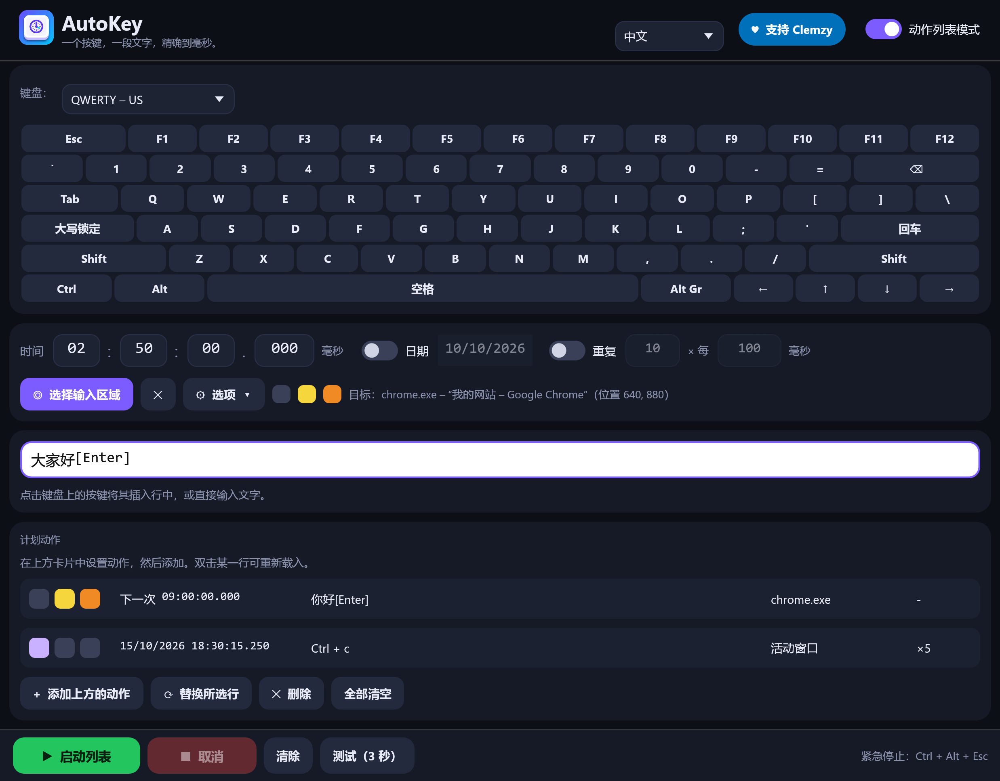

# AutoKey

**在你指定的精确时间，向你指定的窗口输入按键、文本或快捷键。**

🌐 [English](README.md) · [Français](README.fr.md) · [Español](README.es.md) · [Русский](README.ru.md) · [العربية](README.ar.md) · **中文**



AutoKey 是一个用 Rust 编写的小工具，支持 **Windows、Linux 和 macOS**：单个 4 到 6 MB 的可执行文件，无需安装，启动即用，调整窗口大小时界面依然流畅。

## 下载

➡️ **[下载最新版本](../../releases/latest)** — 无需安装，每个系统一个文件：

| 系统 | 文件 | 状态 |
|---|---|---|
| Windows 10/11，64 位 | `AutoKey.exe` | 已测试 |
| Linux，X11 或 Wayland 会话（x86-64 与 ARM64） | `AutoKey-linux-x86_64.tar.gz`、`AutoKey-linux-aarch64.tar.gz` | 已在 Ubuntu 22.04（x86-64）上测试，X11 与 Wayland 均可 |
| macOS 11+（Intel 与 Apple Silicon） | `AutoKey-macos.zip` | 可编译，**尚未在真实 Mac 上测试** |
| Windows on ARM | `AutoKey-windows-arm64.exe` | 可编译，未测试 |

所有文件均未经代码签名 — 首次启动请参阅[各系统说明](#各系统说明)。

## 功能

- **13 种布局的屏幕键盘** — AZERTY（FR、BE）、QWERTY（US、UK、ES、IT、BR）、QWERTZ（DE、CH）、俄语 ЙЦУКЕН、阿拉伯语、Dvorak 与 Colemak。会自动识别系统输入语言对应的布局；中文和日文用户使用 QWERTY（US）。
- **6 种界面语言** — English、Français、Español、Русский、العربية、中文。语言跟随系统，也可在顶部栏随时切换。
- **文本与按键写在同一行**：`你好[Enter]` 会输入“你好”，然后按下回车。文本以 Unicode 输入（重音、符号、任何文字）。方括号中的按键（`[a]`、`[F5]`、`[Enter]`）是真实的按键操作，按目标窗口中实际生效的布局转换，因此可配合按住的修饰键使用（Ctrl、Alt、Shift、AltGr）。
- **精确到毫秒的时间**，可选日期，可选**重复**（次数与间隔）。
- **目标区域**：在想要的输入框中点击一次；AutoKey 会重新找到该窗口（即使目标应用重启过），如已最小化则还原，置于前台，点击该区域，然后输入。若找不到窗口或窗口被遮挡，它会拒绝输入，而不是乱打。
- **每个动作三个选项**，以彩色方块显示：🟣 启动时最小化 AutoKey · 🟡 输入前进入目标区域 · 🟠 之后回到原来的位置。
- **动作列表模式**：可安排多个动作，每个都有各自的时间、文本、目标与选项，按时间顺序执行。
- **紧急停止**：`Ctrl + Alt + Esc`（macOS 为 `Ctrl + Option + Esc`，Wayland 下为“取消”按钮），任何时刻都有效，即使窗口已最小化，或处于重复之间的长时间停顿中。动作就绪期间会**阻止系统休眠**。
- **精度**：设置目标时，窗口会在预定时间前 1.5 秒准备好，使第一个按键在精确时刻发出（实测：+1 到 +2 毫秒）。
- **安全**：延迟超过 30 秒（电脑休眠等）的动作会被跳过，而不是输入到错误的窗口；仅允许单个实例；设置以原子方式写入；若 Windows 拒绝按键（目标以管理员身份运行），会给出清晰提示。
- 数字输入框：点击输入、拖动，或使用 `Ctrl + 鼠标滚轮`。设置保存在用户文件夹中（Windows 为 `%APPDATA%\AutoKey\reglages.json`，Linux 为 `~/.config/AutoKey/`，macOS 为 `~/Library/Application Support/AutoKey/`）。

> 阿拉伯语已完整翻译，并能正确地从右向左显示，但窗口布局本身没有镜像。翻译经过认真撰写，但尚未由母语者审校：非常欢迎提出修正（见*添加或修正语言*）。

## 快速开始

1. 在白色输入行中点击屏幕键盘上的按键（或直接输入文本）。
2. 设置时间。
3. *（可选）* **选择输入区域**，然后点击想要作为目标的输入框。
4. 点击**就绪**。**测试（3 秒）**按钮可让你立即试一下。

以**管理员身份**运行的应用会忽略普通程序发来的按键：这种情况下请以管理员身份运行 AutoKey。

## 各系统说明

**Windows** — 文件未签名，因此首次启动时 SmartScreen 可能会提示：*更多信息* → *仍要运行*。

**Linux** — AutoKey 可在 **X11** 和 **Wayland** 上工作：
- **X11**：按键和点击通过 XTest，窗口通过 EWMH，因此一切功能都可用 — 目标区域、将窗口置于前台、`Ctrl + Alt + Esc`。
- **Wayland**：程序不允许自行发送按键，因此 AutoKey 通过*远程桌面*门户向桌面请求。首次使用时，系统会显示确认窗口：点击**允许**（GNOME 中为**共享**）— 较新的桌面会记住你的选择。之后按键会发送到**活动窗口**：Wayland 同样禁止列出或聚焦其他窗口，因此目标区域和 `Ctrl + Alt + Esc` 快捷键不可用（请使用**取消**按钮，以及*启动时最小化*选项把焦点还给你的应用）。键盘布局中没有的字符，会通过 Unicode 输入 `Ctrl + Shift + U` 输入，GTK 及大多数桌面应用都支持。

解压压缩包并运行 `./autokey`。可选的辅助工具：`xdg-open`（捐赠链接）、`systemd-inhibit`（阻止休眠）、`fc-match`（查找字体）。已在 Ubuntu 22.04（GNOME 42）上测试：X11 下的输入、重音与非拉丁文本、目标选择与窗口聚焦、毫秒级精度（实测 −3 毫秒）和紧急停止；Wayland 下的大写字母、重音、AltGr 符号、西里尔文与中文文本，以及授权被允许和被拒绝两种情况。

**macOS** — 解压 `AutoKey-macos.zip`。该应用未签名也未经公证：首次启动时，请右键点击它并选择*打开*。macOS 会要求你在*系统设置 → 隐私与安全性 → 辅助功能*中允许它（发送按键所需），并在*屏幕录制*中允许它以读取其他窗口的标题。紧急停止为 `Ctrl + Option + Esc`，防休眠使用 `caffeinate`。此版本由 GitHub 的持续集成构建并检查，但**尚未在真实 Mac 上运行过**：欢迎反馈你的发现。

## 从源码构建

需要 [Rust](https://rustup.rs)，以及：

- **Windows**：MSVC 工具链和 *Build Tools for Visual Studio*（“使用 C++ 的桌面开发”）。
- **Linux**：`sudo apt install build-essential pkg-config libx11-dev libxkbcommon-dev libgl1-mesa-dev libwayland-dev`（或你的发行版中的对应软件包）。
- **macOS**：Xcode 命令行工具（`xcode-select --install`）。

```bash
cargo build --release
```

可执行文件生成在 `target/release/autokey`（Windows 上为 `autokey.exe`），如果存在 `.cargo/config.toml`，则生成在其指定的文件夹中。

各系统专用的代码位于 `src/engine/`（`windows.rs`、`linux.rs`、`macos.rs`）；其余部分是共用的。

### 添加或修正语言

所有文本都在一个表中，即 `src/i18n.rs`：每个条目并列给出六种翻译（编译时检查）。键盘布局在 `src/keys.rs` 中。欢迎提交 Pull Request。

### 技术说明：`vendor/eframe`

`eframe` 0.36 会在初始化 OpenGL 之前以隐藏方式创建窗口。在某些较新的 Intel 驱动上（已测试：Iris Xe、Windows 11 build 26300），OpenGL 初始化随后会永久卡住。`vendor/eframe` 是 `eframe 0.36.2` 的副本，其中**只有一行**不同（`src/native/glow_integration.rs` 中的 `with_visible(true)`），并通过 `Cargo.toml` 里的 `[patch.crates-io]` 接入。`eframe` 由 egui 团队以 MIT OR Apache-2.0 许可证发布。

## 自动化测试

`tests/ui_test.py`（Windows）驱动真实窗口（真实的鼠标和键盘），检查 61 个要点：键盘、布局、语言、输入框、选项、列表模式、取消、关闭、向目标窗口输入。

```bash
python tests/ui_test.py target/release/autokey.exe
```

`tests/linux_smoke.sh`（Linux，X11 会话，需要 `xdotool`、`wmctrl`、`xev` 和 `gedit`）检查输入、目标选择与聚焦、时间精度和紧急停止。

```bash
bash tests/linux_smoke.sh target/release/autokey
```

`tests/wayland_smoke.sh`（Wayland 会话，需要 `gedit`）通过门户输入一段混合文本并比较结果；系统窗口出现时由你点击*允许*。

```bash
bash tests/wayland_smoke.sh target/release/autokey
```

| 环境变量 | 作用 |
|---|---|
| `AUTOKEY_SETTINGS=path.json` | 使用另一个设置文件 |
| `AUTOKEY_LANG=zh` / `AUTOKEY_LAYOUT=qwerty-us` | 强制指定语言 / 键盘布局 |
| `AUTOKEY_AUTOARM=N` 或 `HH:MM:SS` | 启动时让动作在 N 秒后（或在指定时间）就绪 |
| `AUTOKEY_AUTOPICK=1` | 启动时开始选择目标区域 |
| `AUTOKEY_SHOT=image.png` | 保存窗口截图后退出 |
| `AUTOKEY_BENCH=1` | 测量调整大小时的帧时间（结果在 `%TEMP%\autokey_bench.txt`） |
| `AUTOKEY_STATE=state.json` | 写出内部状态和每个组件的位置（供 `tests/ui_test.py` 使用） |
| `AUTOKEY_SHOTS=folder` | 按需截图（一个包含文件名的 `req.txt` 文件） |

## 支持本项目

如果 AutoKey 对你有帮助，欢迎支持它的开发：[**💙 通过 PayPal 捐赠**](https://www.paypal.com/donate/?hosted_button_id=NKCR6KK739WGS)

## 作者

**Clemzy**，又名 **InforMagicien** — [MIT 许可证](LICENSE)。
